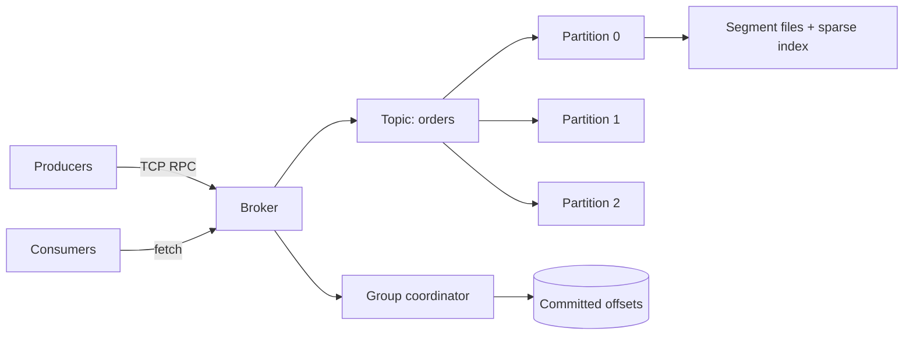

# mini-kafka

[](https://go.dev)
[](LICENSE)
[](go.mod)
[](#testing)

A from-scratch, Kafka-inspired **distributed commit log** in Go. Partitioned,
durable, and restart-safe — with consumer groups, deterministic partition
assignment, and session-based failure detection. Zero third-party
dependencies; the entire broker, protocol, and storage engine are hand-built
on the standard library.

This is the essential Kafka architecture without the JVM: an append-only log
per partition, a broker that serves produce/fetch RPCs, and consumer groups
that track their own offsets.

## Demo

```bash
$ go build -o bin/ ./cmd/...
$ ./bin/broker --addr :9092 --data ./data &
$ ./bin/mkctl topic create orders 3
created orders partitions: 3
$ ./bin/mkctl produce orders '{"order_id":101,"item":"keyboard"}' 0
offset 0
$ ./bin/mkctl consume orders 0 0 10
0 {"order_id":101,"item":"keyboard"}

# Consumer groups
$ ./bin/mkctl group join shoppers alice 3
member alice partitions: [0 1 2]
$ ./bin/mkctl group join shoppers bob 3
member bob partitions: [1]          # rebalanced: alice -> [0 2], bob -> [1]
$ ./bin/mkctl group commit shoppers orders 0 42
committed
$ ./bin/mkctl group status shoppers
orders:0 42

# Kill -9 the broker, restart it, keep going. Nothing is lost:
$ ./bin/mkctl produce orders '{"order_id":102}' 0
offset 1
$ ./bin/mkctl consume orders 0 0 10
0 {"order_id":101,"item":"keyboard"}
1 {"order_id":102}
```

## Architecture



**Storage.** Each partition is an append-only log of size-rolled segment
files. Every record carries a monotonically increasing offset, a timestamp,
and a payload. A sparse index maps every Nth offset to a byte position, and
reads seek through the index before scanning — no full-segment scans for
random-offset reads.

**Crash recovery.** The broker reopens every topic under its data directory
at startup: segment indexes are rebuilt, torn tail writes are truncated, and
new appends continue exactly where the log left off.

**Consumer groups.** Offsets are persisted per group on disk. Partitions are
assigned by deterministic round-robin over sorted member IDs. Members that
stop heartbeating are evicted after a session timeout and their partitions
are rebalanced to survivors.

**Protocol.** Length-prefixed JSON RPC over TCP: `create_topic`,
`list_partitions`, `produce`, `fetch`, `join`, `heartbeat`, `leave`,
`commit`, `offset`, `group_status`.

## Guarantees

Durable **at-least-once** delivery. A message processed before its offset is
committed may be redelivered after a consumer failure. Exactly-once
transactions are intentionally out of scope.

## Project layout

```text
cmd/broker      broker entrypoint
cmd/mkctl       admin CLI: topics, produce/consume, group management
cmd/producer    simple produce client
cmd/consumer    simple fetch client
internal/log        segmented partition log, sparse index, recovery
internal/protocol   TCP framing + RPC types
internal/broker     request dispatch, topic lifecycle
internal/group      group coordinator: membership, assignment, offsets
```

## Testing

```bash
go test -race ./...
```

10 tests cover the log engine (append/read, segment rolling, index seeks,
torn-tail truncation, append-after-recovery), the group coordinator
(deterministic assignment, leave rebalancing, stale-member eviction, offset
commits), the broker (topic recovery across restart, partition listing), and
the wire protocol (framing).

## Roadmap

1. Storage engine + broker RPC
2. Consumer groups + durable offsets
3. Raft-backed partition replication (per-partition leader election and
   failover, reusing the Raft implementation from
   [raft-kv-store](https://github.com/MinuuLakshmi17/raft-kv-store))
4. Benchmarks and failure-injection suite

## Non-goals

Exactly-once transactions, tiered storage, Kafka wire compatibility,
geo-replication, and production-scale controller management.
